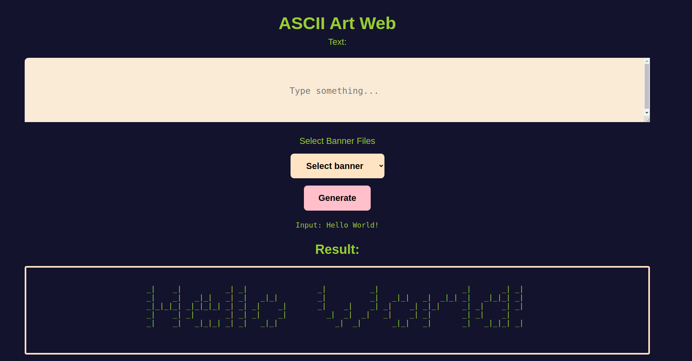

# ascii-art-web

## Description

This project ascii-art-web aims at creating and running a server, displaying an equivalent ASCII art representation of an input on web graphical user interface(GUI). 

This program is written in Go, HTML(Hypertext Markup Language), and styled using Cascading Style Sheet(CSS) for a better visualizaton.

## Authors
This program is authored by [Denil Anyonyi](https://learn.zone01kisumu.ke/git/danyonyi), [Brian Shisia](https://learn.zone01kisumu.ke/git/bshisia) and [Joel Amos](https://learn.zone01kisumu.ke/git/jamos)


## Usage: how to run

* Set up Go language on your machine depending on your system's operating system by following the steps in the official [Go page](https://go.dev/doc/install).

* After setting up your machine, clone the repository from [Gitea](https://learn.zone01kisumu.ke/git/danyonyi/ascii-art-web).

* In the project's root directory, open the terminal and run the program as follows:

```bash
    go run main.go
```

* After running the above command in the terminal, a webpage will be opened on your browser; hosted on the localhost with a specified port number, e.g. *port: 9000*.

* Switch to your browser and type in the search bar and the ASCII-art index page will be displayed. 

```bash
    http://localhost:9000
```


* Type into the input box, a text you would like to be displayed, select a banner file from the choices of banner files provided and press __Generate__ to view the equivalent ASCII-Art representation of your input.

* On execution, the output will be displayed as below:




## Implementation


This program utilizes various Go Standard packages in its implementation. The core packages used are: 
1. *net* package that provides a portable interface for I/O, including TCP/IP(Transmission Control Protocal/Internet Protocal), UDP(User Datagram Protocal), domain name resolution and Unix domain sockets.

Below is an implementation of _http_ package under the *net* package showing the process of making HTTP _POST_ requests:

```go
    func asciiArt(w http.ResponseWriter, r *http.Request){
        if strings.ToUpper(r.Method) != http.MethodPost {
		    serveError(w, "Method Not Allowed", http.StatusMethodNotAllowed)
		    return
	    }
    }

```
2. *path* package that implements utility routing for manipulating slash-separated paths(routes).
Below is an implamentation of the *path* package in defining routes using _filepath_.

```go
    if r.URL.Path != "/" {
		serveError(w, "Page not found", http.StatusNotFound)
		return
	}
	tmpl, err := template.ParseFiles("templates/index.html")
	if err != nil {
		fmt.Fprintf(w, "error: %s", err)
		return
	}
```
3. *text* package that is used to implement data-driven templates for generaing textual output.
```go
    tmpl, err := template.ParseFiles("templates/index.html")
	if err != nil {
		serveError(w, "internal server error", http.StatusInternalServerError)
		return
	}

	tmpl.Execute(w, map[string]string{
		"Result": result,
		"Text":   text,
	})
```
The equivalent template implementation in HTML is defined:
```html
     <div class="result">
            <pre>Input: {{.Text}}</pre>
    </div>
    <div> 
        <h2>Result:</h2>
    </div>
    <div class="result-box">
        {{if .Result}}
        
        <pre>{{.Result}}</pre>
        {{end}}
    </div>
```

* This project also employs CSS to style the index page and present a visually-impressive display.

